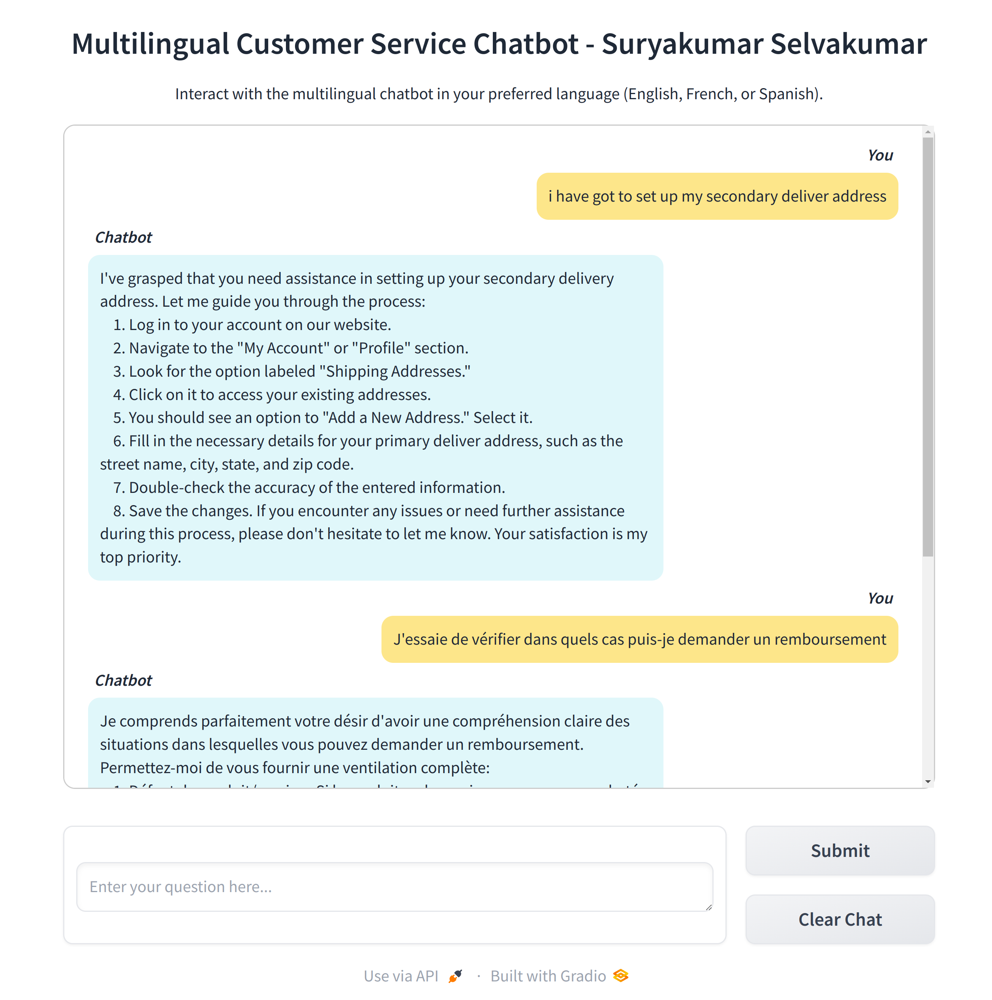

# Development of a Multilingual Customer Service Chatbot

This is my **MS Course Project**, aligned with the course - **Natural Language Processing and Generative AI**, and associated with my **Master's Degree in Computer Science** at the **University of Colorado Denver**.

## Project Description

This project aimed to develop a seamless multilingual single-turn customer service chatbot capable of accurately responding to
inquiries in English, French, and Spanish.

The chatbot was built by fine-tuning the **mBART-large-50** model (which is designed to handle multiple languages within a single framework) on a **Multilingual Customer Support Training Dataset** which includes customer service interactions in the aforementioned three languages.

This multilingual dataset was obtained by using **MarianMT models - _opus-mt-en-fr & opus-mt-en-es_** to translate **Bitext Customer Support LLM Chatbot Training Dataset** (which contains only English interactions) into French and Spanish.

_Note: More info may be added upon completion of Project Report works._

## Sample Output

   </a>

## Instructions to Run the Project

**IMPORTANT: Read all the instructions once before following them**

**1. Fork & Clone the repo:**  
`git clone https://github.com/your-username/your-forked-repo.git`

**2. Download the models folder from this Drive [Link](https://drive.google.com/drive/folders/1Or6SQIoqOEhYCPT2Jrtaha3_OsyKc9xp?usp=sharing)**

- The size of the folder is around `9.2GB`.
- If `COMET` evaluation is not a concern or the user wishes to download the `COMET` model themselves, then please skip that model.
- The download may occur in parts as the large files may not get zipped together with the smaller files. In that case, ensure the following large files are placed in the following paths:

  i) `05d892bf4a3e34b9a4de239109387d43107b2a8c55ad34b73a929ca6c1ede24e` - `models/comet/models--Unbabel--wmt20-comet-qe-da/blobs/`

  ii) `model.ckpt` - `models/comet/models--Unbabel--wmt20-comet-qe-da/snapshots/2e7ffc84fb67d99cf92506611766463bb9230cfb/checkpoints/`

  iii) `model.safetensors` - `models/final_mbart_model/`

  iv) `pytorch_model.bin` - `models/mbart-large-50/`

- Once done, place the `models` folder inside the cloned repo in the same directory as the project notebooks.
- NOTE: I had to store my models on Google Drive as `git-lfs` upload kept failing because my slow internet speed was unreliable.

**3. Use `conda` and `environment.yml` to create a virtual env with all required dependencies:**

- `conda env create -f environment.yml`
- activate conda env with `conda activate chatbot-env`

**4. Steps to run the project files:**

- Create an ipykernel with your conda env using `python -m ipykernel install --user --name=chatbot-env`
- Now, use `jupyter notebook` command to launch the jupyter notebook server, from which you can run the notebooks. Make sure to switch to `chatbot-env` kernel before running the notebooks.
- To interact with the Chatbot, run `python chatbot_interface_gradio.py`. Feel free to use the sample questions in `sample_questions.md`

## Information pertaining to running the project that may be helpful:

**1. Run times for the notebooks and Response times for the Chatbot may vary _drastically_ depending on your system specs. Below is the System that was used to build the project:**

- CPU: _12th Gen Intel(R) Core(TM) i9-12900KF_
- RAM: _32GB_
- GPU: _NVIDIA GeForce RTX 4070 Ti_
- Driver Version: _560.35.03_
- CUDA Version: _12.5_

**2. NOTE:**  
The code in the notebooks are setup in such a way that new data won't be created if that data already exists. If you wish to regenerate any data using any of the models, ensure to delete the respective pre-existing files. Be careful not to delete `Bitext_Sample_Customer_Support_Training_Dataset.csv` as it's the original training dataset.

**3. File-Specific Information:**

- _Notebook - 1 - Multilingual Dataset Creation:_ Translation of the original dataset to `French` and `Spanish` took around `5.14 hrs` on my System.
- _Notebook - 2 - Multilingual Dataset Analysis:_ This notebook should run fairly quickly, the last code cell may take a while depending on your `GPU`.
- _Notebook - 3 - MBart Model Trainer:_ The user will need an extremely powerful GPU to run this notebook, I opted to use Google Colab Pro which provided the `NVIDIA A100-SXM4-40GB` GPU.
- _Notebook - 4 - MBart Model Evaluation:_ This notebook took `11 hrs` to run on my System. Depending on the user's system specs, it may run faster or much slower. Try lowering the `num_beams` parameter in the `generate_response()` function if the run time is too long but the metrics may get worse.
- _chatbot_interface_gradio:_ The response times of the chatbot will vary depending on the user's system. More powerful the System = Faster response times. As before, lowering `num_beams` may help with the response times but the response quality may get worse.
